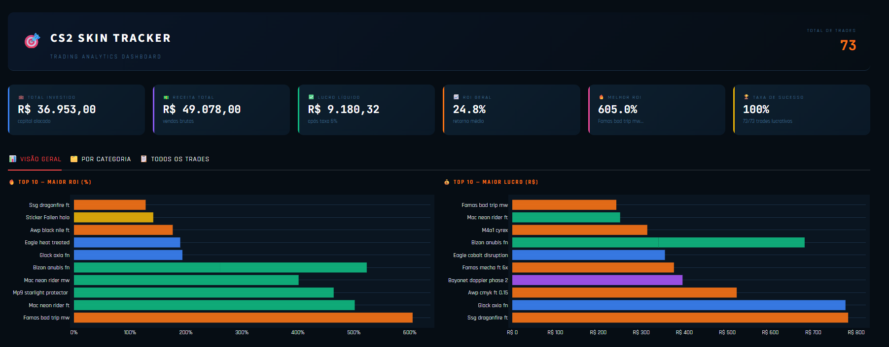
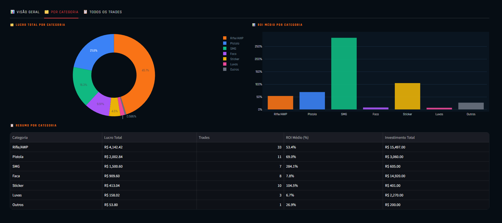
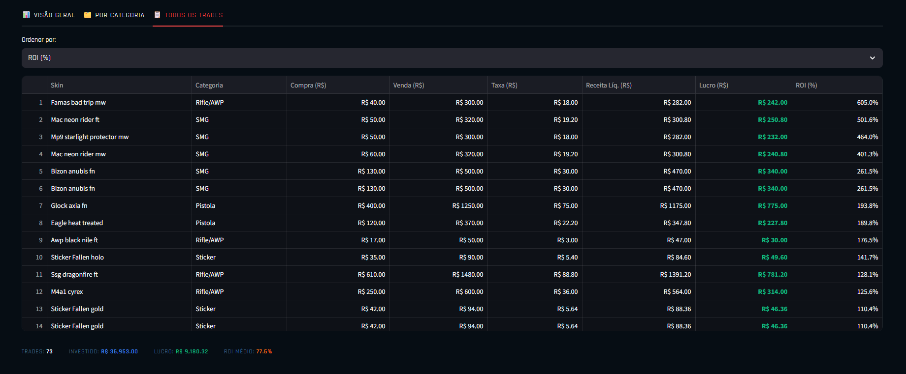

# 🎯 CS2 Skin Tracker — Trading Analytics Dashboard

Dashboard interativo para análise de performance de trades de skins do CS2, construído com **Python + Streamlit + Plotly**.


---

## 📸 Preview

> Dashboard com tema dark gaming, inspirado na identidade visual do CS2.



---



---




---

## 📊 Funcionalidades

### KPIs principais
- 💼 **Total Investido** — capital total alocado nos trades
- 💵 **Receita Total** — soma das vendas brutas
- ✅ **Lucro Líquido** — receita após desconto da taxa de 6%
- 📈 **ROI Geral** — retorno médio ponderado da carteira
- 🔥 **Melhor ROI** — trade com maior percentual de retorno
- 🏆 **Taxa de Sucesso** — percentual de trades com lucro positivo

### Abas do dashboard
| Aba | Conteúdo |
|-----|----------|
| 📊 Visão Geral | Top 10 por ROI%, Top 10 por Lucro, Scatter Investimento × Lucro |
| 🗂️ Por Categoria | Pizza de lucro, ROI médio por categoria, tabela resumida |
| 📋 Todos os Trades | Tabela completa com ordenação e células coloridas por performance |

### Filtros interativos (sidebar)
- Filtro por **categoria** de item (Rifle/AWP, Faca, Pistola, SMG, Luvas, Sticker)
- Filtro por **faixa de ROI**
- Todos os gráficos e KPIs atualizam em tempo real

---

## 🚀 Deploy
▶️ Acesse online

O dashboard está publicado e disponível sem instalação:

👉Acesse aqui:  https://cs2dashboard.streamlit.app

## 💻 Como rodar localmente

### 1. Clone o repositório
```bash
git clone https://github.com/fformentini/skinsCS2-analytics.git
cd skinsCS2-analytics
```

### 2. Instale as dependências
```bash
pip install -r requirements.txt
```

### 3. Execute o dashboard
```bash
streamlit run cs2_dashboard.py
```

---

## 📦 Dependências

```txt
streamlit>=1.32.0
plotly>=5.18.0
pandas>=2.0.0
openpyxl>=3.1.0
```

Ou instale diretamente:
```bash
pip install streamlit plotly pandas openpyxl
```

---

## 📁 Estrutura do projeto

```
skinsCS2-analytics/
│
├── cs2_dashboard.py       # App principal (Streamlit)
├── requirements.txt       # Dependências Python
├── README.md              # Documentação
│
└── assets/
    └── main.png        # Screenshot do dashboard
```

---

## 🧮 Lógica de cálculo

Todos os valores são calculados automaticamente a partir do preço de compra e venda:

```
Taxa         = Venda Bruta × 6%
Receita Líq. = Venda Bruta − Taxa
Lucro        = Receita Líquida − Preço de Compra
ROI          = (Lucro / Preço de Compra) × 100
```

> A taxa de 6% representa a comissão padrão do mercado da Steam.

---

## 🗂️ Categorias de itens

| Categoria | Exemplos |
|-----------|----------|
| Rifle/AWP | AK-47, M4A1-S, AWP, FAMAS, Survival |
| Faca      | Bayonet, Falchion, M9, Butterfly |
| Pistola   | Glock, P250, USP-S, Desert Eagle |
| SMG       | MAC-10, MP9, Bizon, MP7, P90 |
| Luvas     | Gloves, Classic |
| Sticker   | Fallen Gold, Fallen Holo |

---

## 🛠️ Stack técnica

- **[Streamlit](https://streamlit.io/)** — framework para apps de dados em Python
- **[Plotly](https://plotly.com/python/)** — gráficos interativos
- **[Pandas](https://pandas.pydata.org/)** — manipulação e análise dos dados
- **Fonte:** [Rajdhani](https://fonts.google.com/specimen/Rajdhani) + [JetBrains Mono](https://fonts.google.com/specimen/JetBrains+Mono) via Google Fonts

---

## 📄 Licença

MIT License — sinta-se livre para usar, modificar e distribuir.

---

<p align="center">Feito com 💻 e ☕ por <a href="https://github.com/fformentini">Fabrício Formentini</a></p>
